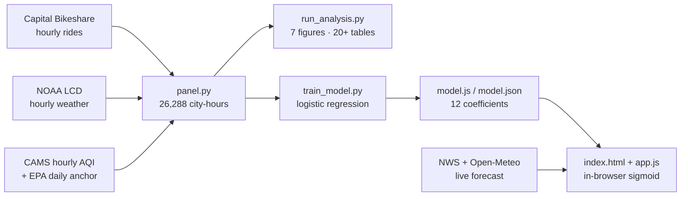
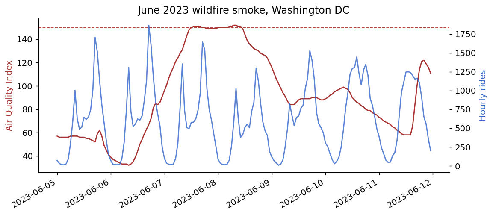
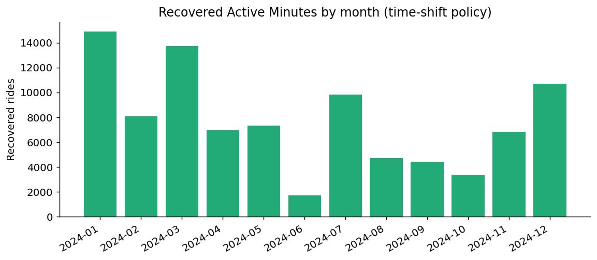
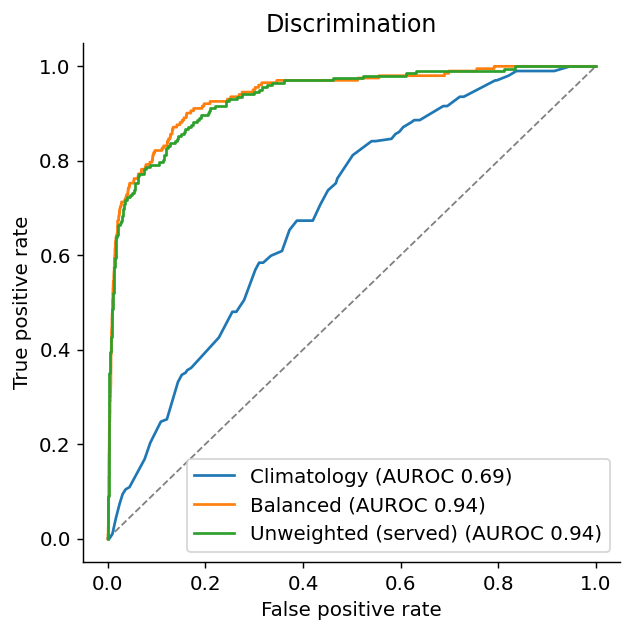
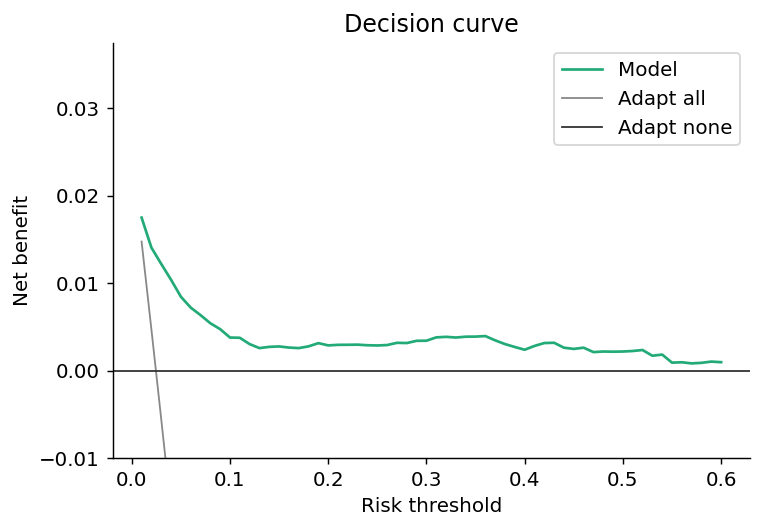

<div align="center">

# PulseShift

**Will weather or air quality kill your outdoor session? A calibrated forecast that runs in your browser — and the safest hour to go anyway.**

**[▶ Live demo](https://urme-b.github.io/PulseShift/)** · **[🔬 Pipeline](research/)** · **[📚 Data dictionary](research/data/README.md)**

</div>

---

## What it does

- Enter conditions (or pull live DC weather) → get the probability the session is **suppressed**, a risk band, and a recommendation.
- Scans the next 24 h of forecast + hourly AQI and points to the **lowest-risk safe daytime hour**.
- Hard safety rails override the model: **heat index ≥ 103 °F or AQI ≥ 150 → unsafe, full stop**.
- Inference is a 12-coefficient logistic dot product through a sigmoid.

## Architecture



## Results at a glance

Washington DC, 2022–2024. Leak-free out-of-time split: **train 2022–23 (16,150 h) → test 2024 (8,204 h)**; the served model is then refit on all three years.

| Metric (2024 hold-out) | Value | 95% CI |
| --- | --- | --- |
| AUROC | **0.936** | 0.90 – 0.97 |
| AUPRC (base rate 2.5%) | 0.49 | 0.32 – 0.64 |
| Brier score | **0.021** | 0.017 – 0.026 |
| ECE (calibration error) | 0.044 | 0.036 – 0.052 |
| Cross-city transfer (Seoul) | AUROC 0.87 · ECE 0.02 | n = 2,117 |
| Recoverable lost mobility (policy upper bound) | ≤ 37% | 33 – 41% |
| Unsafe recommendations issued | **0** | audited |

## Finding 1 — Calibration decides usability, not AUROC

Class-weighting (the common imbalance default) keeps AUROC but wrecks the probabilities. The unweighted served model stays on the diagonal.

| Model | AUROC | Brier ↓ | ECE ↓ |
| --- | --- | --- | --- |
| Season-aware climatology | 0.692 | 0.027 | 0.053 |
| **Logistic, unweighted (served)** | **0.936** | **0.021** | **0.044** |
| Logistic, class-weighted | 0.940 | 0.128 ⚠ | 0.253 ⚠ |
| Class-weighted + isotonic | 0.940 | 0.029 | 0.064 |
| Gradient boosting | 0.941 | 0.025 | 0.046 |


## Finding 2 — Air quality adds zero forecast skill beyond weather

| Feature set | AUROC | AUPRC | Brier |
| --- | --- | --- | --- |
| Temporal only | 0.509 | 0.026 | 0.027 |
| + Weather | **0.936** | 0.488 | 0.021 |
| + Air quality | 0.936 | 0.488 | 0.021 |

Δ ≈ 0 on every metric. Cold, rain, and humidity drive suppression here — not smoke. And the exposure measure matters even for a coefficient's *sign*:

| AQI measure in the served model | Standardized coefficient |
| --- | --- |
| Hourly (used) | **+0.036** ✓ correctly signed |
| Daily (swapped in) | −0.039 ✗ wrong sign |

## Finding 3 — The "pollution suppresses activity" effect is mostly seasonal confounding

| Identification | Effect (ride-ratio pts per +50 AQI) | 95% CI |
| --- | --- | --- |
| Marginal (no controls) | *apparently protective* | seasonal artifact |
| Between-day, season+weather controlled (the literature's usual spec) | **−10.9** | −14.6 to −7.3 |
| Within-day fixed effects (hourly AQI) | **−2.4** | −5.9 to +1.1 |
| Matched high-AQI vs clean hours (AQI ≥ 100) | ratio 1.01× | 0.94 – 1.08 |


Not underpowered: the within-day SE (1.8) matches the between-day SE (1.9), and the 80%-power MDE (~5 pts) sits well below −10.9 — an effect that large would have surfaced within-day. Not measurement error either: at CAMS↔EPA reliability 0.73 the corrected effect is −3.3, and even at an aggressive 0.3 only −8.0 — still short of −10.9. And part of the −10.9 → −2.4 gap is exposure definition, not confounding — between-day uses daily-*peak* AQI, within-day *hourly* — so the matched-hours row (1.01×), exposure held fixed, is the cleanest de-confounding check.

The marginal curve is the trap: suppression *falls* as AQI rises because the dirtiest hours are peak-summer hours — until season is controlled.


Even the June 2023 Canadian-wildfire smoke barely registers: 8 June fell to 0.76× expected ridership — only the 6th-lowest of 66 summer weekdays, and confounded by official advisories.



## Safety-constrained time-shift policy

Shift a risky hour by ≤ ±3 h only if predicted risk drops meaningfully **and** the target hour is safe (HI < 103 °F, AQI < 150).

| Policy metric | Value |
| --- | --- |
| Otherwise-lost mobility recovered (upper bound, full transfer) | **37%** (CI 33–41) |
| At a realistic 50% transfer efficiency | ~18% |
| Rides / rider-minutes recovered | ~93k / ~1.2M |
| Hours shifted / cancelled | 14% / 0.06% |
| Mean risk reduction per shift | 0.16 |
| Recommendations in unsafe conditions | **0** (audited in tests) |



**More evidence — ROC + decision curve.**

<table><tr>
<td></td>
<td></td>
</tr></table>

At a 10:1 miss-to-flag cost ratio: threshold 0.09 → sensitivity 0.90, specificity 0.82, 20% of hours flagged.

## Model card

**Target** — an active city-hour is *suppressed* when rides < 0.5 × a weather-free, leak-free `season × daytype × hour` climatology (fit on training years only). 24,354 active hours; 6.0% suppressed.

<table width="100%">
<tr><th align="left" width="18%">Feature group</th><th align="left">Inputs (12 total)</th></tr>
<tr><td>Thermal</td><td>heat index (NWS), cold stress max(0, 55−T), heat stress max(0, HI−85)</td></tr>
<tr><td>Air</td><td>hourly AQI, smoke/haze flag, visibility</td></tr>
<tr><td>Weather</td><td>humidity, wind, precipitation</td></tr>
<tr><td>Time</td><td>hour (sin, cos), weekend</td></tr>
</table>

<table width="100%">
<tr><th align="left" width="18%">Safety rail</th><th align="left">Threshold</th><th align="left">Behavior</th></tr>
<tr><td>Heat index</td><td>≥ 103 °F</td><td>Unsafe — overrides model output</td></tr>
<tr><td>AQI</td><td>≥ 150</td><td>Unsafe — overrides model output</td></tr>
<tr><td>Best-hour search</td><td>06:00–21:00 local</td><td>Skips any hour breaching either rail</td></tr>
</table>

Inference: `p = σ( w · (x − μ) / s + b )`.

## Reproduce

```bash
git clone https://github.com/urme-b/PulseShift && cd PulseShift
make all        # venv + analysis + model export + tests (~3 min)
```

| Command | Does |
| --- | --- |
| make analysis | Regenerates all 7 figures + 20+ tables from the committed panel |
| make model | Refits and exports model.js / model.json |
| make data | Rebuilds the panel from public sources (network) |
| make seoul | Cross-city validation run |
| make test / make lint | 21 tests · ruff · mypy |

## Data

| Source | Provides | Access |
| --- | --- | --- |
| Capital Bikeshare | Hourly ride counts by rider type, 2022–2024 | Public S3 |
| NOAA LCD (Reagan National) | Hourly temp, humidity, wind, visibility, precip, smoke codes | Public |
| CAMS via Open-Meteo | **Hourly** US AQI + PM2.5 (~80% coverage) | Public, keyless |
| EPA AirData | Daily AQI anchor + smoke cross-check | Public |

Live demo inputs: NWS (api.weather.gov) + Open-Meteo hourly AQI — keyless, fetched client-side.

## Robustness

Every analyst knob is swept, not silently fixed:

| Knob | Sweep | Result |
| --- | --- | --- |
| Label ratio ρ | 0.4 / 0.5 / 0.6 | AUROC 0.92–0.95, ECE ≤ 0.07 |
| Activity floor | 10 / 20 / 30 rides | AUROC 0.93–0.94 |
| High-AQI cutoff | 80 / 100 / 120 | Ride ratio ≈ 1.0, all CIs span 1 |
| Shift window | ±2 / ±3 / ±4 h | RAM 30 / 37 / 42%, **0 unsafe at every setting** |
| Season | winter → fall | AUROC 0.90–0.96 |

Equity note: casual riders bear ~1.9× the suppression burden of members (9.5% vs 5.1% of active hours).

## Repo map

| Path | What |
| --- | --- |
| index.html · app.js · styles.css | The app — static, zero dependencies |
| model.js / model.json | Served coefficients + safety thresholds + metadata |
| research/pulseshift/ | Pipeline: ingest → panel → features → models → calibration → identification → policy |
| research/scripts/ | build_data · run_analysis · train_model · validate_seoul |
| research/tests/ | 21 tests: heat index, leak-free label, FE estimator, safety audit, export parity |

## Tech stack

| Layer | Tools |
| --- | --- |
| App | Vanilla HTML / CSS / JS · static · CSP-locked · in-browser inference |
| Model | scikit-learn logistic regression → 12 coefficients exported to JS |
| Pipeline | Python 3.12–3.14 · pandas · NumPy · SciPy · matplotlib |
| Live data | NWS API · Open-Meteo CAMS (both keyless) |
| Quality | pytest + coverage · ruff · mypy · pip-audit · GitHub Actions · bootstrap CIs · decision-curve analysis |

## Limitations

- **One region.** Trained and validated on Washington DC only; Seoul is a method check, not a deployment — coefficients don't transfer without a refit.
- **Proxy target.** Bike-share ridership is outdoor mobility demand, not measured exercise; any health reading needs external validation.
- **Live ≠ training sources.** The app pulls NWS + Open-Meteo; the model was fit on NOAA + CAMS. CAMS underreads localized smoke (~150 vs EPA's 196 on 8 Jun 2023), so the within-day AQI effect is, if anything, conservative.
- **Informational only.** The rails are coarse guardrails — not medical or emergency guidance. Follow official advisories.

## Roadmap

- [ ] Validate the ridership proxy against measured activity (wearable/survey)
- [ ] Ground-station hourly AQI in place of CAMS
- [ ] Multi-city replication of the confounding result (pipeline is city-configurable)
- [ ] Neighborhood-level equity analysis
- [ ] Small forecast API

## License

[MIT](LICENSE)
