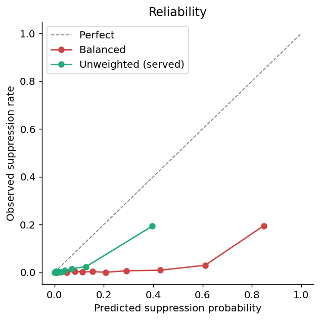
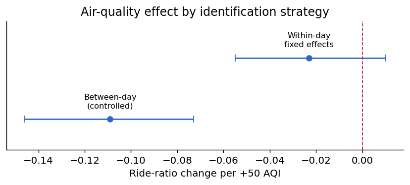
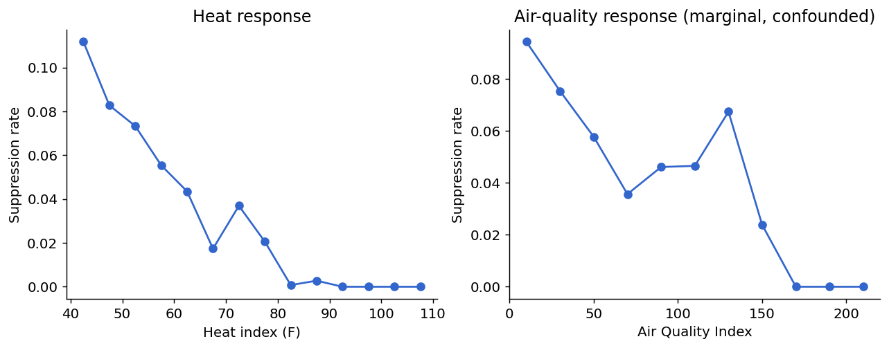

# PulseShift

PulseShift predicts whether weather or air quality will ruin a planned outdoor session, and suggests the safest time to do it anyway. It's a single web page that runs the model right in your browser, with a Python pipeline and a full write-up behind it, built on three years of real Washington DC data.

**▶ [Try the live demo](https://urme-b.github.io/PulseShift/)**

## Using it

- Enter your session's conditions → get the odds the weather will suppress it, plus a recommendation.
- A hard rule overrides the model: heat index ≥ 103°F or AQI ≥ 150 → flagged unsafe, full stop.
- On the live forecast, it also points out the safest hour of the day to go.

## Results

Washington DC, 2022 to 2024. The metrics come from a leak-free out-of-time split (train on 2022 and 2023, test on 2024), and the model the app actually serves is then refit on all three years.

What makes a forecast usable isn't raw accuracy, it's calibration. Class-weighting the model leaves it badly overconfident; the unweighted version the app serves stays on the diagonal.



The headline finding is about air quality, and it's a cautionary one: the effect of pollution on this mobility proxy depends entirely on how you measure it. The naive association looks *protective*. A season-controlled daily regression finds a large negative effect. But a within-day fixed-effects estimate, which holds season and weather fixed, collapses it toward zero. That gap is seasonal confounding, and only hourly air quality exposes it.



The marginal curve makes the trap visual: suppression appears to *fall* as AQI rises, only because the dirtiest hours are peak summer hours, until you control for season.



- Features push forecast AUROC from 0.69 (a season-aware baseline) up to 0.94, and gradient boosting is no better on AUROC (it edges only AUPRC).
- The served model is well calibrated out-of-time (Brier 0.021, ECE 0.044).
- **Air quality adds nothing to the forecast beyond weather** (ΔAUROC ≈ 0). Here it's cold and rain that drive suppression, not smoke.
- That season-controlled between-day effect (−10.9 ride-ratio points per +50 AQI) shrinks to −2.4 (95% CI −5.9 to +1.1) once you identify it within-day.
- A safety-constrained time-shift policy claws back up to ~37% of otherwise-lost activity (an upper bound), and never recommends an unsafe hour.
- The same pipeline reaches AUROC 0.87 on a second city, Seoul.

The full write-up, figures, and confidence intervals are in [paper/paper.md](paper/paper.md).

## How it works

- **Target:** a logistic regression predicts whether a given hour of outdoor cycling is *suppressed*, meaning ridership below half of a weather-free seasonal and diurnal baseline.
- **Features (12):** heat index, hourly AQI, humidity, wind, precipitation, two temperature hinge terms, visibility, a smoke flag, and a cyclical encoding of hour and weekend.
- **Pipeline:** train in Python → export to model.js as twelve coefficients → the page standardizes inputs and applies them directly.
- **Inference:** a dot product through a sigmoid, so there's no server, no build step, no API keys.

## Method

- **Leak-free, out-of-time validation.** Train on 2022 and 2023, test on held-out 2024; the label's climatology is fit on training years only (test-year volume carried forward), so nothing leaks.
- **Hourly air quality.** Daily AQI swapped for hourly (CAMS, anchored to EPA daily), which is what makes within-day identification possible.
- **An identification ladder.** The AQI effect estimated three ways: marginal, between-day (season-controlled), and within-day fixed effects. Most of it is seasonal confounding.
- **A feature ablation.** Temporal → weather → air quality, out-of-time, isolating what air quality adds (essentially nothing).
- **Calibration first.** Brier, log loss, ECE, calibration slope, and a decision curve, across unweighted, class-weighted, and isotonic variants, not AUROC alone.
- **Quantified uncertainty.** 95% bootstrap CIs, day-clustered for the within-day estimator, resampled over days for the policy metric.
- **Power, not just a null.** The within-day design reports its minimum detectable effect, so the near-zero result is bounded-small, not underpowered.
- **Sensitivity over silence.** Every analyst choice (label ratio, activity floor, shift window, AQI threshold) is swept and reported.

## Limitations

- **Single region.** Everything here is trained and validated on Washington DC (2022–2024). The Seoul run is a method check, not a second deployment; coefficients do not transfer, so the served model should not be trusted outside DC without a refit.
- **Proxy target, not measured activity.** The label is bike-share ridership below half of a seasonal/diurnal baseline — a proxy for outdoor mobility demand that bundles commuting, errands, and tourism, not observed exercise. Any physical-activity or health reading needs external validation against measured data.
- **Data-source caveats.** Training weather is NOAA LCD and air quality is CAMS hourly reanalysis anchored to EPA daily; the live forecast instead pulls NWS (weather.gov) for weather and Open-Meteo CAMS for hourly AQI, so live inputs are a different source than the model was fit on. CAMS underestimates localized smoke plumes versus ground stations (it read ~150 AQI on 8 June 2023 where the EPA station recorded 196), so the within-day air-quality estimate is conservative for exactly the smoke events of interest.
- **Not for safety-critical decisions.** The forecast and time-shift suggestion are informational. The hard heat-index/AQI cutoffs are coarse guardrails, not medical or emergency guidance — do not rely on this tool for health, safety, or operational decisions.

Fuller caveats, confidence intervals, and the minimum-detectable-effect analysis are in [paper/paper.md](paper/paper.md#8-limitations).

## Tech stack

<table width="100%">
<tr><th align="left" width="14%">Layer</th><th align="left">Tools</th></tr>
<tr><td>App</td><td>HTML, CSS, JavaScript, zero-dependency, static</td></tr>
<tr><td>Model</td><td>scikit-learn, logistic regression, in-browser inference</td></tr>
<tr><td>Pipeline</td><td>Python, pandas, NumPy, scikit-learn, matplotlib</td></tr>
<tr><td>Data</td><td>Capital Bikeshare, NOAA LCD, EPA AirData, CAMS hourly AQI</td></tr>
<tr><td>Quality</td><td>pytest, GitHub Actions, bootstrap CIs, decision-curve analysis</td></tr>
</table>

## Reproduce

```
make all       # venv, analysis, model export, tests
```

Requires Python 3.12 to 3.14 (all tested in CI). The processed panel is committed (with a checksum and a column-level [data dictionary](research/data/README.md)), so analysis and tests run without re-downloading the raw data.

## Future scope

- [ ] Validate the ridership proxy against measured activity (wearable or survey data)
- [ ] Replace CAMS hourly AQI with ground-station hourly measurements
- [ ] Replicate the confounding result across cities (the pipeline is city-configurable)
- [ ] Neighborhood-level equity analysis
- [ ] Expose the forecast as a small API

## Contributing

- Setup, test, and reproduction steps: [CONTRIBUTING.md](CONTRIBUTING.md)
- Participation is governed by the [Code of Conduct](CODE_OF_CONDUCT.md)
- Vulnerabilities go through the [security policy](SECURITY.md)

## License

[MIT License](LICENSE)
